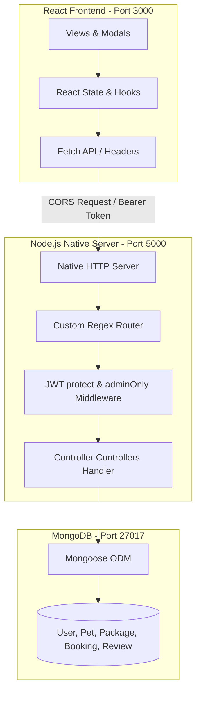

# PawPaths — Full-Stack Pet Travel Logistics & Booking Platform

PawPaths is a full-stack pet relocation travel booking platform. Converted from a static React client to a multi-role web application, PawPaths operates on a custom, lightweight Node.js native API backend (implemented without Express.js) backed by MongoDB.

The application allows users to register, manage their pets' health profiles, search and filter custom travel packages, and reserve travel itineraries. Administrators can monitor bookings, adjust booking and payment statuses, edit package listings, moderate customer reviews, and view aggregated metrics from a dedicated dashboard.

---

## Technical Architecture

The platform is designed to be lightweight, secure, and modular. It uses standard HTTP connections, custom middleware pipelines, and structured database object modeling.



---

## Features

### 🐾 Client View Features
* **Authentication**: Safe registration and logins using JWT stored in local storage.
* **Pet Profiles**: CRUD management for pets (name, weight, age, breed, vaccination status, and medical remarks).
* **Package Browsing & Filters**: Real-time filters for travel packages by destination, budget (slider), pet size allowed, transport type, and minimum ratings.
* **Booking reservations**: Check-out modal matching package dimensions and decrementing available seats on confirmation.
* **Review Ratings**: Write, modify, or delete review logs on completed bookings. Average package ratings are recalculated dynamically.
* **Responsive Layouts**: Elegant mobile, tablet, and desktop views styled with vanilla CSS variables and CSS media queries.

### 🛡️ Admin Dashboard Features
* **Overview Analytics**: Aggregated platform metrics (total clients, total packages, reservation counts, and total revenue).
* **Booking Approvals**: Approve or reject pending bookings, which dynamically updates seat availability.
* **Package Publishing**: Create, update, or delete travel destinations.
* **Review Moderation**: Audit and delete inappropriate comments.
* **User Accounts Audit**: View and manage customer profiles.

---

## Tech Stack

* **Frontend**: React (Create React App), Vanilla CSS.
* **Backend**: Node.js utilizing **native modules only** (`http`, `crypto`, `url`, `fs`, `path`).
* **Database**: MongoDB (Mongoose ODM).
* **Security & Auth**: `bcryptjs` (password hashing) and `jsonwebtoken` (auth guards).

---

## Folder Structure

```
PawPath-main/
├── backend/
│   ├── config/
│   │   └── db.js            # MongoDB Mongoose connection
│   ├── middleware/
│   │   └── auth.js          # Authentication (protect & adminOnly) guards
│   ├── models/
│   │   ├── User.js          # User schema (roles: 'user', 'admin')
│   │   ├── Pet.js           # Pet profiles schema (species, vaccinations)
│   │   ├── Package.js       # Travel packages schema
│   │   ├── Booking.js       # Bookings schema (generates unique BK-XXXXXX ids)
│   │   └── Review.js        # Reviews schema (calculates averages)
│   ├── controllers/
│   │   ├── authController.js
│   │   ├── petController.js
│   │   ├── packageController.js
│   │   ├── bookingController.js
│   │   ├── reviewController.js
│   │   └── adminController.js
│   ├── routes/
│   │   └── api.js           # Endpoint-to-controller mapping
│   ├── utils/
│   │   ├── router.js        # Custom Native Node.js HTTP router
│   │   └── seeder.js        # Database seeder script
│   └── server.js            # Main native HTTP server entry point (Port 5000)
├── public/                  # Static assets & index.html template
├── src/
│   ├── PawPaths.jsx         # Integrated React components and client UI views
│   ├── index.js             # Root render
│   └── index.css            # Base styles
├── .env                     # Local environment configurations (ignored from git)
├── .env.example             # Placeholder environment variables template
├── LICENSE                  # MIT License details
└── package.json             # Root npm dependencies and script registry
```

---

## Setup & Installation

### 1. Prerequisites
Ensure you have the following installed:
* [Node.js](https://nodejs.org/) (v16+)
* [MongoDB](https://www.mongodb.com/) running locally (port `27017`)

### 2. Install Dependencies
Clone the repository and run npm install at the root folder:
```bash
npm install
```

### 3. Environment Variables Setup
Create a `.env` file at the root folder of the project based on the `.env.example` template:
```env
MONGODB_URI=mongodb://127.0.0.1:27017/pawpath
PORT=3000
BACKEND_PORT=5000
JWT_SECRET=your_secret_key_here
```

### 4. Database Seeding
Initialize MongoDB collections with standard travel packages, test user accounts, sample bookings, and reviews:
```bash
npm run seed
```

### 5. Running the Application
To run the React frontend and Node.js backend concurrently:
```bash
npm run dev
```
* React Frontend will run on: `http://localhost:3000`
* Native HTTP Server will run on: `http://localhost:5000`

---

## API Overview

### Public Routes
* `POST /api/auth/register` - Create user profile.
* `POST /api/auth/login` - Authenticate credentials and return JWT.
* `GET /api/packages` - Fetch and filter travel packages list.
* `GET /api/packages/:id` - Fetch details for a specific package.

### Protected User Routes (Require `Authorization: Bearer <token>`)
* `GET /api/auth/profile` - Retrieve current user profile.
* `PUT /api/auth/profile` - Update user profile.
* `GET /api/pets` - Fetch user's registered pets.
* `POST /api/pets` - Register a new pet.
* `PUT /api/pets/:id` - Update pet details.
* `DELETE /api/pets/:id` - Remove a pet.
* `GET /api/bookings` - Fetch user's booking history.
* `POST /api/bookings` - Book a travel package.
* `PUT /api/bookings/:id/cancel` - Cancel a booking reservation.
* `POST /api/reviews` - Submit trip review.
* `PUT /api/reviews/:id` - Modify trip review.
* `DELETE /api/reviews/:id` - Delete review.

### Administrator Routes (Require `Authorization: Bearer <token>` and Admin role)
* `GET /api/admin/stats` - Fetch platform aggregate metrics.
* `GET /api/admin/users` - Fetch user directories.
* `DELETE /api/admin/users/:id` - Delete user account.
* `GET /api/admin/bookings` - Fetch all platform bookings.
* `PUT /api/admin/bookings/:id/status` - Approve or reject bookings.
* `POST /api/admin/packages` - Create a travel package.
* `PUT /api/admin/packages/:id` - Edit a travel package.
* `DELETE /api/admin/packages/:id` - Delete a travel package.
* `GET /api/admin/reviews` - Audit customer comments.
* `DELETE /api/admin/reviews/:id` - Delete a customer review.

---

## Demo Credentials

You can log in with the following seeded accounts after running the seed command:

| Role | Email | Password |
|---|---|---|
| **Regular User** | `user@pawpaths.com` | `userpassword` |
| **Administrator** | `admin@pawpaths.com` | `adminpassword` |

---

## Screenshots

* **Homepage & Packages Search**:
  
* **User Dashboard & Bookings Tracking**:
  
* **Admin Statistics Control Center**:
  

---

## Future Enhancements
* **Real-time Live Chat**: Coordinator support during travel.
* **Document Uploading**: Dedicated document repository for health certificates and customs approvals.
* **Stripe Payment Gateway**: Online checkout.
* **Route Geo-Tracking**: Live GPS tracking of pets during travel.

---

## License
Distributed under the MIT License. See [LICENSE](file:///c:/Users/samee/Downloads/PawPath-main/PawPath-main/LICENSE) for more information.